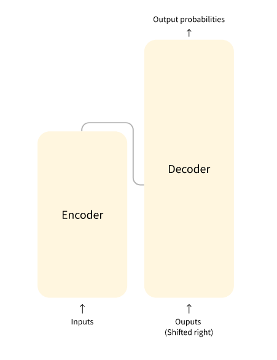
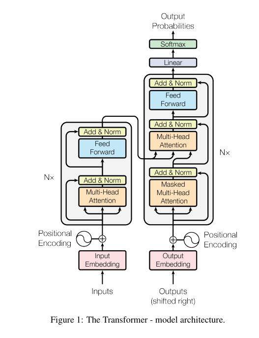

# How do transformers work?

> [Anterior](./1.%20What_can_they_do?.md) |  | [Siguiente](./3.%20EncoderDecoder_models.md)

## A bit of history
[Transformer architecture](https://arxiv.org/abs/1706.03762) *attention is all you need paper* se introdujo primero en junio de 2017 con la idea de usarla para labores de traducción. Tras esta introducción se introdujeron varios modelos:
- GPT
- BERT
- GPT-2
- DistilBERT
- BART, T5
- GPT-3

La siguiente lista es muy incompleta pero en términos generales se podrían clasificar en los siguientes tipos:
- GPT-like : Modelos de transformación auto-regresivos (auto-regresive)
- BERT-like : Modelos de transformación auto-codificables (auto-encoding)
- BART/T5-like : Modelos de transformación secuencia-secuencia (sequence-sequence)

## Transformers are LMs
Todos estos son modelos de lenguaje. Han sido entrenados en grandes corpus de texto siguiendo la técnica de self-supervision. Este tipo de modelos tienen un conocimiento estadístico del lenguaje, pero no son útiles en tareas prácticas. Para compensar esto se les introduce en un proceso de *transfer learning* en el cual se hace fine-tune del modelo para darles una tarea más específica.

Estos transformers son modelos grandes. Para mejorar su performance por lo general se incrementa aún más su tamaño y el corpus de entrenamiento. Estas condiciones hacen que entrenar un modelo de este tipo sea una tarea computacionalmente cara y no sea accesible para todos.

## Transfer learning
La técnica consiste en tomar un modelo existente y entrenarlo más allá para un objetivo más específico. Una técnica que se lleva implementando desde hace 10 años en visión artificial. Es lo que se conoce como *fine-tuning* 

Por lo general cabe mencionar que dependiendo del modelo base existe cierto *bias* que modifica su funcionamiento debido a los datos en los cuales fue entrenado. Por ejemplo GPT-3 predecía adjetivos referentes a cualidades mentales en hombres y a cualidades físicas en mujeres.

SIEMPRE debemos buscar un modelo preentrenado lo más cercano a la tarea que queramos realizar con el modelo fine-tuneado.

## Arquitectura general

Cómo funcionan ambos bloques:
- Encoder: Acepta inputs de texto, los convierte en representaciones numéricas (embeddings o features). Bi-directional, self-attention
- Decoder: Utiliza la representación del codificador (features) junto a otros inputs para generar una secuencia objetivo. Está optimizado para generar los outputs. Uni-direccional, auto-regressive, masked self-attention.

Each of these parts can be used independently, depending on the task:
- Encoder-only models: Good for tasks that require understanding of the input, such as sentence classification and named entity recognition.
- Decoder-only models: Good for generative tasks such as text generation.
- Encoder-decoder models or sequence-to-sequence models: Good for generative tasks that require an input, such as translation or summarization.

## Attention layers
Se exploran más en profundidad más adelante. El paper que introduce estas arquitecturas de hecho se llama ["Attention is all you need"](https://arxiv.org/abs/1706.03762). De momento basta con asumir que sirve para realmente poner más atención a ciertas palabras que a otras. 

*To put this into context, consider the task of translating text from English to French. Given the input “You like this course”, a translation model will need to also attend to the adjacent word “You” to get the proper translation for the word “like”, because in French the verb “like” is conjugated differently depending on the subject. The rest of the sentence, however, is not useful for the translation of that word. In the same vein, when translating “this” the model will also need to pay attention to the word “course”, because “this” translates differently depending on whether the associated noun is masculine or feminine. Again, the other words in the sentence will not matter for the translation of “course”. With more complex sentences (and more complex grammar rules), the model would need to pay special attention to words that might appear farther away in the sentence to properly translate each word.*

## Arquitectura original
*The Transformer architecture was originally designed for translation. During training, the encoder receives inputs (sentences) in a certain language, while the decoder receives the same sentences in the desired target language. In the encoder, the attention layers can use all the words in a sentence (since, as we just saw, the translation of a given word can be dependent on what is after as well as before it in the sentence). The decoder, however, works sequentially and can only pay attention to the words in the sentence that it has already translated (so, only the words before the word currently being generated). For example, when we have predicted the first three words of the translated target, we give them to the decoder which then uses all the inputs of the encoder to try to predict the fourth word.*

*Note that the first attention layer in a decoder block pays attention to all (past) inputs to the decoder, but the second attention layer uses the output of the encoder. It can thus access the whole input sentence to best predict the current word. This is very useful as different languages can have grammatical rules that put the words in different orders, or some context provided later in the sentence may be helpful to determine the best translation of a given word.*

*The attention mask can also be used in the encoder/decoder to prevent the model from paying attention to some special words — for instance, the special padding word used to make all the inputs the same length when batching together sentences.*

## Arquitecturas vs checkpoints
- Arquitectura: Esqueleto del modelo, qué hace cada capa y qué operaciones existen en el modelo.
- Checkpoint: Pesos que se van a cargar en una arquitectura dada.
- Modelo: Término *paraguas* que no es tan preciso como arquitectura o checkpoint. Evitarlo si se desea evitar ambigüedad

*For example, BERT is an architecture while bert-base-cased, a set of weights trained by the Google team for the first release of BERT, is a checkpoint. However, one can say “the BERT model” and “the bert-base-cased model.”*
