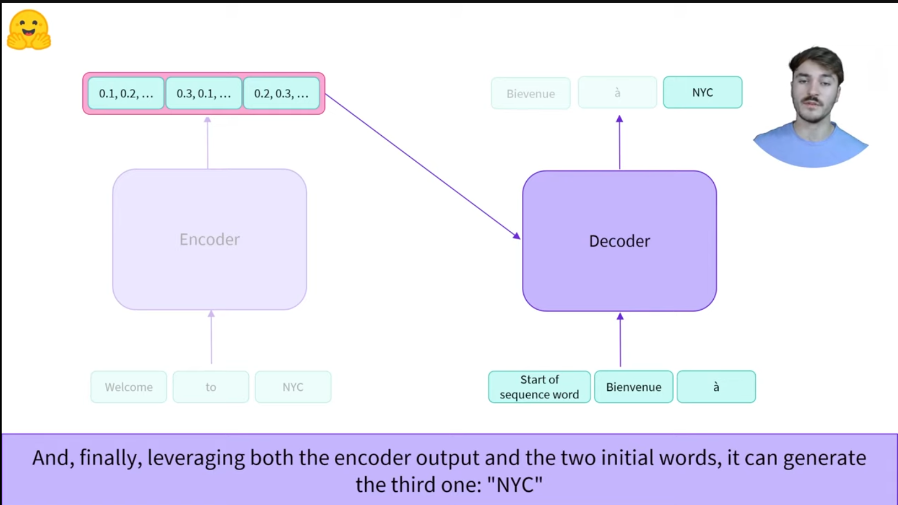

# Encoder-Decoder (Sequence-to-sequence)

> [Anterior](./3.%20EncoderDecoder_models.md) |  | [Siguiente](./5.%20Bias_and_limitations.md)

Se ve muy bien el funcionamiento conjunto de un codificador + decodificador en la siguiente imagen:

> El codificador se encarga de generar unos vectores densos en información que pasa como input al decodificador. Por otro lado, el decodificador toma ambos el vector y la frase original como inputs para empezar a generar palabras en base a cómo ha sido entrenado. En este caso, busca traducir el input, por lo tanto empieza con "Bienvenido" en francés y luego continúa iterando sobre las palabras que él mismo genera hasta acabar de generar la traducción.

En base a esto, **podríamos concluir que el codificador se encarga de entender la frase original y lo qué significa, mientras el decodificador se encarga de entender la representación numérica del codificador.** Este último puede estar entrenado para entender otros idiomas o incluso otras modalidades como imágenes o voz.

Las utilidades de la estrategia sequence2sequence (por poner ejemplos) podrían ser traducción o sintetización. A mayores podríamos usar cualquier tipo de combinaciones de codificador-decodificador.

