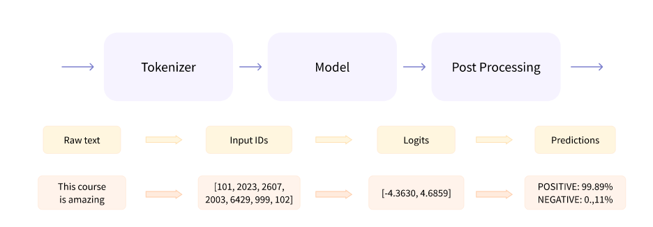
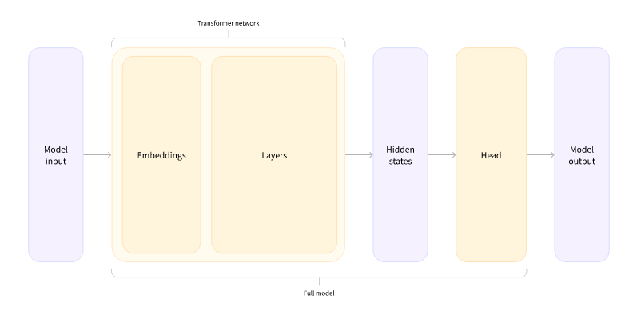

# Behind the pipeline

> [Anterior](../1.%20Transformer_Models/5.%20Bias_and_limitations.md) |  | [Siguiente](./2.%20Models.md)

Let's take a look at what happens inside this example from Chapter 1:
```python
from transformers import pipeline

classifier = pipeline("sentiment-analysis")
classifier(
    [
        "I've been waiting for a HuggingFace course my whole life.",
        "I hate this so much!",
    ]
)

[{'label': 'POSITIVE', 'score': 0.9598047137260437},
 {'label': 'NEGATIVE', 'score': 0.9994558095932007}]
```

En el capítulo 1 el pipeline junta los siguientes pasos pasando los inputs por el modelo y postprocesado



## Preprocesado con tokenizador
Como otras redes neuronales, transformers models tampoco pueden procesar texto puro directamente. El primer paso de la pipeline en este caso será convertir el input textual en números que el modelo entienda. Para ello se usan los tokenizadores, responsables de:
- Dividir texto en palabras, subpalabras o símbolos llamados *tokens*
- Mapear cada token sobre un integer.
- Añadir inputs extra que sean útiles para el modelo.

Todo este preprocesado debe hacerse igual que cuando el modelo fue preentrenado, por ello necesitamos descargar la información de [Model Hub](https://huggingface.co/models). *To do this, we use the AutoTokenizer class and its from_pretrained() method. Using the checkpoint name of our model, it will automatically fetch the data associated with the model’s tokenizer and cache it (so it’s only downloaded the first time you run the code below).*

```python
from transformers import AutoTokenizer

checkpoint = "distilbert-base-uncased-finetuned-sst-2-english"
tokenizer = AutoTokenizer.from_pretrained(checkpoint)
```

*Once we have the tokenizer, we can directly pass our sentences to it and we’ll get back a dictionary that’s ready to feed to our model! The only thing left to do is to convert the list of input IDs to tensors.*

*You can use 🤗 Transformers without having to worry about which ML framework is used as a backend; it might be PyTorch or TensorFlow, or Flax for some models. However, Transformer models only accept tensors as input. If this is your first time hearing about tensors, you can think of them as NumPy arrays instead. A NumPy array can be a scalar (0D), a vector (1D), a matrix (2D), or have more dimensions. It’s effectively a tensor; other ML frameworks’ tensors behave similarly, and are usually as simple to instantiate as NumPy arrays.*

*To specify the type of tensors we want to get back (PyTorch, TensorFlow, or plain NumPy), we use the return_tensors argument:*
```python
raw_inputs = [
    "I've been waiting for a HuggingFace course my whole life.",
    "I hate this so much!",
]
inputs = tokenizer(raw_inputs, padding=True, truncation=True, return_tensors="pt")
print(inputs)
```

```python
{
    'input_ids': tensor([
        [  101,  1045,  1005,  2310,  2042,  3403,  2005,  1037, 17662, 12172, 2607,  2026,  2878,  2166,  1012,   102],
        [  101,  1045,  5223,  2023,  2061,  2172,   999,   102,     0,     0,     0,     0,     0,     0,     0,     0]
    ]), 
    'attention_mask': tensor([
        [1, 1, 1, 1, 1, 1, 1, 1, 1, 1, 1, 1, 1, 1, 1, 1],
        [1, 1, 1, 1, 1, 1, 1, 1, 0, 0, 0, 0, 0, 0, 0, 0]
    ])
}
```
*The output itself is a dictionary containing two keys, input_ids and attention_mask. input_ids contains two rows of integers (one for each sentence) that are the unique identifiers of the tokens in each sentence. We’ll explain what the attention_mask is later in this chapter.*


## Tras el modelo
Podemos descargar el modelo tal como hicimos con el tokenizador. La librería tiene una clase *AutoModel* que sirve para utilzar modelos preentrenados *(.from_pretrained(checkpoint))*
```python
from transformers import AutoModel

checkpoint = "distilbert-base-uncased-finetuned-sst-2-english"
model = AutoModel.from_pretrained(checkpoint)
```

*In this code snippet, we have downloaded the same checkpoint we used in our pipeline before (it should actually have been cached already) and instantiated a model with it.*

*This architecture contains only the base Transformer module: given some inputs, it outputs what we’ll call hidden states, also known as features. For each model input, we’ll retrieve a high-dimensional vector representing the contextual understanding of that input by the Transformer model.*

La salida en vector del modulo de Transformers suele ser grande. Generalmente tiene las siguientes dimensiones:
1. Batch size: Número de secuencias procesadas de una vez (2 en el ejemplo)
2. Sequence length: Longitud de la representación numérica de la secuencia (16 en ejemplo)
3. Hidden size: Vector dimension de cada input del modelo. Puede ser un valor grande (normalmente 768 en pequeños modelos, 3072 en más grandes)

Podemos verlo si alimentamos los inputs preprocesados al modelo:
```python
outputs = model(**inputs)
print(outputs.last_hidden_state.shape)
```
    torch.Size([2, 16, 768])

*Note that the outputs of 🤗 Transformers models behave like namedtuples or dictionaries. You can access the elements by attributes (like we did) or by key (outputs["last_hidden_state"]), or even by index if you know exactly where the thing you are looking for is (outputs[0]).*


## Model heads: Making sense of numbers
Model heads toman el vector altamente dimensional de los *hidden states* y lo proyectan a una dimensión diferente. En la siguiente imagen se puede ver con claridad:



Vemos en el diagrama las diversas partes del modelo: Embddings, capas, hidden states y head. Embeddings convierte cada input ID en un vector que representa cada token. Las capas lo manipulan/usan siguiendo el mecanismo de atención para producir la representación final de las frases.

A continuación una lista no exhaustiva de las diferentes arquitecturas que existen en Transformers, cada una pensada para una tarea específica.
- *Model (retrieve the hidden states)
- *ForCausalLM
- *ForMaskedLM
- *ForMultipleChoice
- *ForQuestionAnswering
- *ForSequenceClassification
- *ForTokenClassification
- and others 🤗

En nuestro ejemplo con una cabecera clasificadora de secuencias? (sequence classification head) para ser capaces de clasificar si las frases son positivas o negativas. No usaremos la clase AutoModel si no AutoModelForSequenceClassification.
```python
from transformers import AutoModelForSequenceClassification

checkpoint = "distilbert-base-uncased-finetuned-sst-2-english"
model = AutoModelForSequenceClassification.from_pretrained(checkpoint)
outputs = model(**inputs)
```

Si vemos la forma de nuestros outputs, la dimensionalidad es mucho menor: "model head" toma como input los vectores altamente dimensionales y saca de salida vectores conteniendo dos valores.

    print(outputs.logits.shape)
    torch.Size([2, 2])


## Postprocessing the output
Los valores de salida del modelo no necesariamente tienen sentido por sí mismos. Usando :print(outputs.logits)

    tensor([[-1.5607,  1.6123],
        [ 4.1692, -3.3464]], grad_fn=<AddmmBackward>)

Estos valores no se tratan de probabilidades si no de logits, las puntuaciones no normalizadas y puras salidas de la última capa del modelo. Para convertirse en probabilidades, necesitan ir a través de una capa [SoftMax](https://en.wikipedia.org/wiki/Softmax_function) debido a que la "loss function" del entrenamiento generalmente fusionará la última función de activación con la "loss function" real como cross entropy.
```python
import torch

predictions = torch.nn.functional.softmax(outputs.logits, dim=-1)
print(predictions)
```
    tensor([[4.0195e-02, 9.5980e-01],
        [9.9946e-01, 5.4418e-04]], grad_fn=<SoftmaxBackward>)

Estas otras dos sí que son puntuaciones de probabilidad reconocibles. De hecho, podemos también obtener las etiquetas respetivas a cada posición de la siguiente forma:
```python
model.configid2label
```
    {0: 'NEGATIVE', 1: 'POSITIVE'}


Ahora que sabemos qué era cada tag podemos confirmar lo siguiente:
- First sentence: NEGATIVE: 0.0402, POSITIVE: 0.9598
- Second sentence: NEGATIVE: 0.9995, POSITIVE: 0.0005

De esta forma se reproducen los 3 pasos del pipeline:
1. Preprocesado con tokenizers.
2. Pasar los inputs por el modelo.
3. Postprocesado. Saber probabilidad de cada resultado.


