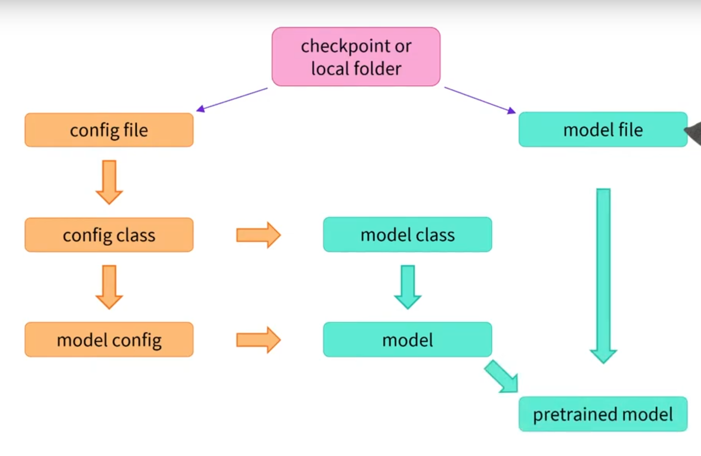

# Models

> [Anterior](./1.%20Behind_the_pipeline.md) |  | [Siguiente](./3.%20Tokenizers.md)

## Instantiate a transformers model
**(behind from_pretrained)**
```python
from transformers import AutoModel

bert_model = AutoModel.from_pretrained("bertbase-cased")
print(type(bert_model))
```
    <class 'transformers.models.bert.modeling_bert.BertModel>


Cuando descargamos un modelo lo que se hace es:
1. Tomar un checkpoint o carpeta local.
2. Tomar un archivo de configuración (tipo de transformer)
3. Crea una configuración de modelo
4. Carga el archivo del modelo con los pesos específicos.




## Creando un Transformer
Lo primero que necesitaremos es cargar un objeto de configuración.
```python
from transformers import BertConfig, BertModel

# Building the config
config = BertConfig()

# Building the model from the config
model = BertModel(config)
```
```python
print(config)
```
```python
BertConfig {
  [...]
  "hidden_size": 768,
  "intermediate_size": 3072,
  "max_position_embeddings": 512,
  "num_attention_heads": 12,
  "num_hidden_layers": 12,
  [...]
}
```

## Diferentes formas de cargar un modelo
Creating a model from the default configuration initializes it with random values:
```python
from transformers import BertConfig, BertModel

config = BertConfig()
model = BertModel(config)

# Model is randomly initialized!
```

*The model can be used in this state, but it will output gibberish; it needs to be trained first.*

Loading a Transformer model that is already trained is simple:
```python
from transformers import BertModel
model = BertModel.from_pretrained("bert-base-cased")
```

*As you saw earlier, we could replace BertModel with the equivalent AutoModel class. We’ll do this from now on as this produces **`checkpoint-agnostic code; if your code works for one checkpoint, it should work seamlessly with another.`** This applies even if the architecture is different, as long as the checkpoint was trained for a similar task (for example, a sentiment analysis task).*

*This model is now initialized with all the weights of the checkpoint. It can be used directly for inference on the tasks it was trained on, and it can also be fine-tuned on a new task. By training with pretrained weights rather than from scratch, we can quickly achieve good results.*


## Saving methods
Guardar análogamente a from_pretrained()
```python
model.save_pretrained("directory_on_my_computer")
```

Esto guarda dos archivos en tu disco:
```python
ls directory_on_my_computer

config.json pytorch_model.bin
```

Tenemos *config.json* que tiene los atributos necesarios para cargar la arquitectura del modelo y metadatos. También tenemos pytorch_model.bin conocido como el *diccionario de estado*. Contiene los pesos del modelo. Ambos archivos van de la mano y son necesarios para funcionar.


## Usar un Transformer model para inferencia.
Transformer models can only process numbers - números generados por los tokenizadores.

Digamos que tenemos las siguientes secuencias:
```python
sequences = ["Hello!", "Cool.", "Nice!"]
```

El tokenizador convierte estas a índices de vocabulario típicamente llamados input IDs. Cada secuencia es ahora una lista de números con la salida resultante:
```python
encoded_sequences = [
    [101, 7592, 999, 102],
    [101, 4658, 1012, 102],
    [101, 3835, 999, 102],
]
```

Una lista de secuencias codificadas: Una lista de listas. Los tensores solamente aceptan formas rectangulares (como matrices). Al ser esta ya de forma rectangular convertirla a tensor es fácil:
```python
import torch

model_inputs = torch.tensor(encoded_sequences)
```

## Usando los tensores como inputs para el modelo
Simplemente se llama al modelo con los inputs:
```python
output = model(model_inputs)
```

Solamente los *input IDs* son necesarios. Más adelante se explicará qué hacen otros argumentos.


