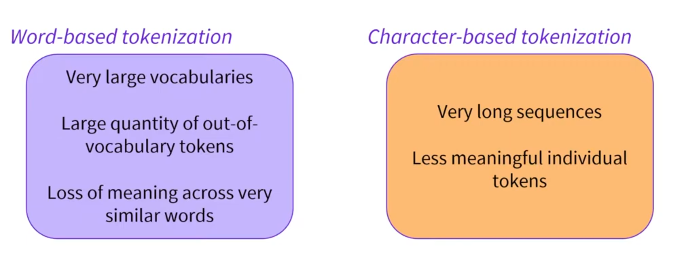

# Tokenizers

> [Anterior](./2.%20Models.md) |  | [Siguiente](./4.%20Multiple_Sequences.md)

El objetivo de los tokenizers es convertir el texto puro a números. Puede haber muchas aproximaciones pero el objetivo principal es tener una representación significativa del mismo.

Hay diversas técnicas de las cuales observaremos las siguientes 3:
1. Word based
2. Character based
3. Subword based

## Word-based
La idea es dividir el texto en espacios. Quizá también añadiendo reglas para dividir puntuaciones. Cada palabra tendría una ID específica.

1. Uno de los problemas es que por ejemplo, le daríamos unas IDs completamente diferentes a dos palabras con significados muy parecidos como por ejemplo los plurales (dog -> dogs)
2. Por otro lado, el vocabulario del tokenizador puede ser muy grande debido a la gran cantidad de palabras que existen.
3. Sin embargo, siempre podemos elegir que el tokenizador ignore algunas palabras cubriendo por ejemplo las palabras más usadas. Sin embargo, esto resultaría en una pérdida de información con muchas palabras desconocidas para el tokenizador que serían todas catalogadas por ejemplo como [UNK] (de unknown)

Nota: A mayor el vocabulario del tokenizador mayor será la cantidad de pesos que necesite para entender.


## Character-based
Esto cubriría las debilidades de word-based debido a que independientemente de la cantidad de palabras que existan, el vocabulario seguirá siendo pequeño porque los caracteres son independientes de eso. En adición, no existirán (en principio) tokens desconocidos.

Sin embargo, este algoritmo tampoco es perfecto. En primer lugar, un caracter no incluye tanta información como una palabra, aunque esto se pueda contrargumentar con que depende del lenguaje (Chino). En segundo lugar, estamos inyectando cantidades de tokens muy grandes, haciendo que el tamaño de ventana de contexto del modelo se empequeñezca.




## Subword-based
Pretende combinar las fuerzas de los dos métodos anteriores. Esto sigue dos técnicas fundamentales:
1. Aquellas palabras muy utilizadas no deberían ser divididas en subpalabras. [DOG -> token1]
2. Palabras raras deberían ser descompuestas en subpalabras con mucho valor significativo. [DOGS -> DOG + S -> token1 + token2], [TOKENIZATION -> TOKEN + IZATION -> token3 + token4]
3. Algunos algoritmos de tokenización pueden identificar inicios, continuaciones y finales de palabras.

La mayoría de modelos obtienen resultados a nivel de estado del arte usando algún tipo de algoritmo subword-tokenization

Unsurprisingly, there are many more techniques out there. To name a few:

- Byte-level BPE, as used in GPT-2
- WordPiece, as used in BERT
- SentencePiece or Unigram, as used in several multilingual models


## Loading and saving
Basado en los mismos métodos que los modelos. Tenemos *from_pretrained* y *save_pretrained*. Por ejemplo para usar el tokenizador BERT:
```python
from transformers import BertTokenizer
tokenizer = BertTokenizer.from_pretrained("bert-base-cased")
```

Como con *AutoModel*, *AutoTokenizer* usará la clase tokenizadora correspondiente basándose en el nombre del checkpoint y puede usarse directamente con cualquier checkpoint.
```python
from transformers import AutoTokenizer
tokenizer = AutoTokenizer.from_pretrained("bert-base-cased")

# Ahora se puede usar como vimos
tokenizer("Using a Transformer network is simple")
```
    {'input_ids': [101, 7993, 170, 11303, 1200, 2443, 1110, 3014, 102],
     'token_type_ids': [0, 0, 0, 0, 0, 0, 0, 0, 0],
    'attention_mask': [1, 1, 1, 1, 1, 1, 1, 1, 1]}

Finalmente, para guardar el tokenizador
```python
tokenizer.save_pretrained("directory_on_my_computer")
```


## Encoding
Tokenization pipeline: From input text to list of numbers.
1. Split text into tokens (tokenization)
2. El tokenizador añade tokens especiales que el modelo espera.
3. Convertir tokens a input IDs

El método de decodificación de los tokenizadores nos permite ver cómo el output final se traduce en texto

### Tokenization
Hecho por el método *tokenize()*
```python
from transformers import AutoTokenizer

tokenizer = AutoTokenizer.from_pretrained("bert-base-cased")

sequence = "Using a Transformer network is simple"
tokens = tokenizer.tokenize(sequence)

print(tokens)
```

Dando de output una lista de strings o tokens:

    ['Using', 'a', 'transform', '##er', 'network', 'is', 'simple']

### Tokens a input IDs
Realizada mediante *convert_tokens_to_ids()*
```python
ids = tokenizer.convert_tokens_to_ids(tokens)
print(ids)
```
    [7993, 170, 11303, 1200, 2443, 1110, 3014]


## Decoding
El opuesto: convertir índices de vocabulario a string. Esto puede hacerse con *decode()*
```python
decoded_string = tokenizer.decode([7993, 170, 11303, 1200, 2443, 1110, 3014])
print(decoded_string)
```
    'Using a Transformer network is simple'

El decodificar deshace los tokens especiales y junta las subpalabras.

