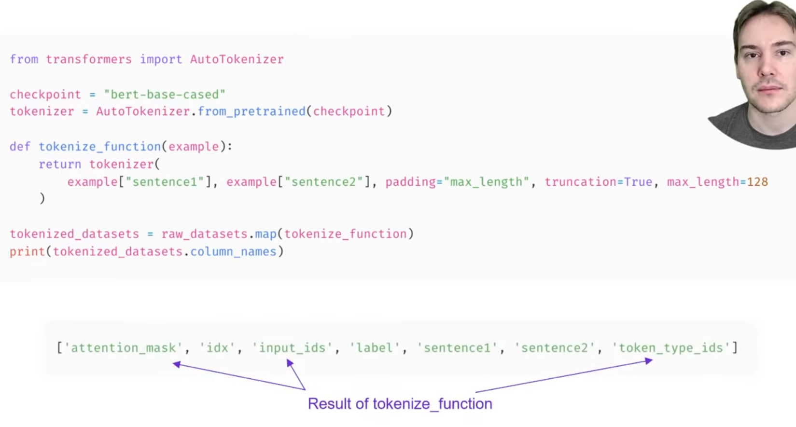
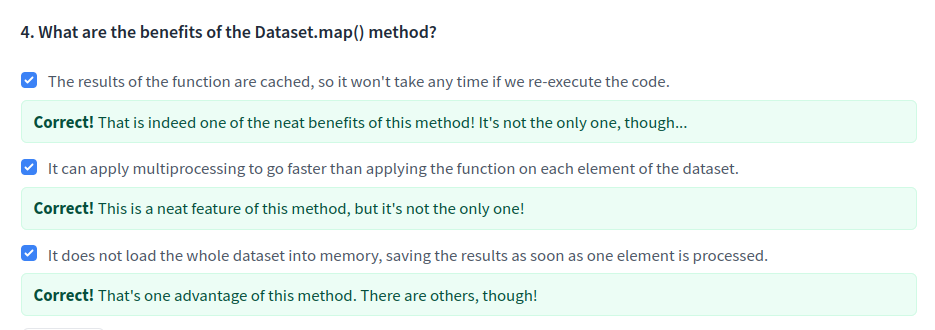

# Processing the data

> [Anterior](../2.%20Using_Transformers/5.%20Putting_all_together.md) |  | [Siguiente](./2.%20Trainer_API_Keras.md)  

Así es como entrenaríamos un "sequence classifier" en un solo batch en Pytorch:
```python
import torch
from transformers import AdamW, AutoTokenizer, AutoModelForSequenceClassification

# Same as before
checkpoint = "bert-base-uncased"
tokenizer = AutoTokenizer.from_pretrained(checkpoint)
model = AutoModelForSequenceClassification.from_pretrained(checkpoint)
sequences = [
    "I've been waiting for a HuggingFace course my whole life.",
    "This course is amazing!",
]
batch = tokenizer(sequences, padding=True, truncation=True, return_tensors="pt")

# This is new
batch["labels"] = torch.tensor([1, 1])

optimizer = AdamW(model.parameters())
loss = model(**batch).loss
loss.backward()
optimizer.step()
```

Por supuesto entrenar solo con dos muestras no dará buenos resultados. Para ello necesitaríamos un dataset más grande.


## Loading a dataset from the Hub
Los dataset están divididos en splits. Por lo general tenemos los split train, validation y test. Podemos acceder a cada split por su clave y luego a cualquier elemento por índice del dataset. Por ejemplo, el siguiente dataset:
```python
from datasets import load_dataset

raw_datasets = load_dataset("glue", "mrpc")
raw_datasets
```
```python
DatasetDict({
    train: Dataset({
        features: ['sentence1', 'sentence2', 'label', 'idx'],
        num_rows: 3668
    })
    validation: Dataset({
        features: ['sentence1', 'sentence2', 'label', 'idx'],
        num_rows: 408
    })
    test: Dataset({
        features: ['sentence1', 'sentence2', 'label', 'idx'],
        num_rows: 1725
    })
})
```
Podemos acceder a un elemento de la siguiente forma:
```python
raw_train_dataset = raw_datasets["train"]
raw_train_dataset[0]
```
```python
{'idx': 0,
 'label': 1,
 'sentence1': 'Amrozi accused his brother , whom he called " the witness " , of deliberately distorting his evidence .',
 'sentence2': 'Referring to him as only " the witness " , Amrozi accused his brother of deliberately distorting his evidence .'}
```

Features nos da información sobre cada columna:

    raw_train_dataset.features
```python
{'sentence1': Value(dtype='string', id=None),
 'sentence2': Value(dtype='string', id=None),
 'label': ClassLabel(num_classes=2, names=['not_equivalent', 'equivalent'], names_file=None, id=None),
 'idx': Value(dtype='int32', id=None)}
```

*Behind the scenes, label is of type ClassLabel, and the mapping of integers to label name is stored in the names folder. 0 corresponds to not_equivalent, and 1 corresponds to equivalent.*



El método *map()* permite aplicar una función sobre todos los splits de un dataset. Para que funcione bien, este método debe retornar un diccionario y las claves de este diccionario serán añadidas al dataset.

## Preprocessing a dataset
Clasificación de textos puede aplicarse en pares de frases por ejemplo clasificando si se contradicen, son neutrales o se confirman. De hecho, en GLUE benchmark, 8/10 datasets tienen pares de oraciones.
Modelos como BERT están preentrenados para reconocer relaciones entre 2 frases.
De hecho, los tokenizadores aceptan pares de frases como frases solas. Para ello, preparan token type IDs y máscaras de atención además de insertar tokens especiales.

Sin embargo, no podemos simplemente pasar dos secuencias al modelo y obtener una predicción respecto a ambas. Debemos pasarlas como una pareja y procesar adecueadamente. Por suerte, los tokenizadores aceptan 2 frases.
```python
inputs = tokenizer("This is the first sentence.", "This is the second one.")
inputs
```
    { 
    'input_ids': [101, 2023, 2003, 1996, 2034, 6251, 1012, 102, 2023, 2003, 1996, 2117, 2028, 1012, 102],
    'token_type_ids': [0, 0, 0, 0, 0, 0, 0, 0, 1, 1, 1, 1, 1, 1, 1],
    'attention_mask': [1, 1, 1, 1, 1, 1, 1, 1, 1, 1, 1, 1, 1, 1, 1]
    }

Si decodificamos:
```python
tokenizer.convert_ids_to_tokens(inputs["input_ids"])
```
    ['[CLS]', 'this', 'is', 'the', 'first', 'sentence', '.', '[SEP]', 'this', 'is', 'the', 'second', 'one', '.', '[SEP]']

Viendo que se añade un solo [CLS] y dos [SEP], además los token_type_ID separan también las frases utilizando un vector de 0s y 1s:

    [0, 0, 0, 0, 0, 0, 0, 0, 1, 1, 1, 1, 1, 1, 1]

Tras ver un poco cómo funciona la tokenización, hay que tener en cuenta que queremos tener esto en forma de dataset. Para mantenerlo así, utilizaremos la función *map()* junto a una función para generar los input_ids, token_type_ids y attention_mask para cada elemento del dataset:
```python
def tokenize_function(example):
    return tokenizer(example["sentence1"], example["sentence2"], truncation=True)

tokenized_datasets = raw_datasets.map(tokenize_function, batched=True)
tokenized_datasets
```
Podemos ver que de esta forma *.map()* añade esas columnas al dataset.
```python
DatasetDict({
    train: Dataset({
        features: ['attention_mask', 'idx', 'input_ids', 'label', 'sentence1', 'sentence2', 'token_type_ids'],
        num_rows: 3668
    })
    validation: Dataset({
        features: ['attention_mask', 'idx', 'input_ids', 'label', 'sentence1', 'sentence2', 'token_type_ids'],
        num_rows: 408
    })
    test: Dataset({
        features: ['attention_mask', 'idx', 'input_ids', 'label', 'sentence1', 'sentence2', 'token_type_ids'],
        num_rows: 1725
    })
})
```



## Dynamic padding
Es una técnica usada para realizar padding por batches en lugar de para todo el dataset. De esta forma ahorramos capacidad computacional ya que hacer padding usando como referencia la frase más larga sería más caro.

Para hacerlo en la práctica se haría de la siguiente forma:
```python
from transformers import DataCollatorWithPadding

data_collator = DataCollatorWithPadding(tokenizer=tokenizer)
```
Toma el tokenizador como argumento para saber qué token de padding se usaría y si se espera padding a la izquierda o derecha.

Para probar la herramienta usamos el siguiente código:
```python
samples = tokenized_datasets["train"][:8]
samples = {k: v for k, v in samples.items() if k not in ["idx", "sentence1", "sentence2"]}
[len(x) for x in samples["input_ids"]]
```
    [50, 59, 47, 67, 59, 50, 62, 32]

Donde se ve que cada batch tendrá una longitud máxima específica con un máximo de 67.


