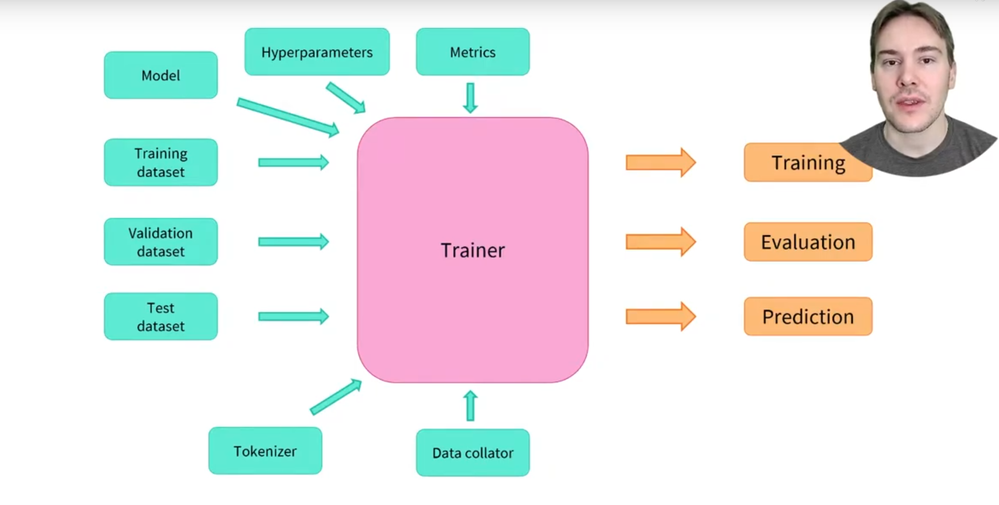

# The Trainer API

> [Anterior](./1.%20Processing_data.md) |  | [Siguiente](./3.%20A_full_training.md)

## Training
Trainer class que sirve para fine-tunear cualquier modelo preentrenado en nuestro dataset. Una vez hayamos hecho el preprocesamiento del punto anterior hay pocos pasos para definir el *Trainer*. Lo más difícil es preparar el entorno para ejecutar Trainer.train() porque iría muuuy lento en CPU.


```python
# Pre process GLUE MRCP
from datasets import load_dataset
from transformers import AutoTokenizer, DataCollatorWithPadding

raw_datasets = load_dataset("glue", "mrpc")
checkpoint = "bert-base-uncased"
tokenizer = AutoTokenizer.from_pretrained(checkpoint)


def tokenize_function(example):
    return tokenizer(example["sentence1"], example["sentence2"], truncation=True)


tokenized_datasets = raw_datasets.map(tokenize_function, batched=True)
data_collator = DataCollatorWithPadding(tokenizer=tokenizer)
```

Argumentos para crear el Trainer:
```python
from transformers import TrainingArguments
from transformers import AutoModelForSequenceClassification

training_args = TrainingArguments("test-trainer")
model = AutoModelForSequenceClassification.from_pretrained(checkpoint, num_labels=2)
```
*"You will notice that unlike in Chapter 2, you get a warning after instantiating this pretrained model. This is because BERT has not been pretrained on classifying pairs of sentences, so the head of the pretrained model has been discarded and a new head suitable for sequence classification has been added instead. The warnings indicate that some weights were not used (the ones corresponding to the dropped pretraining head) and that some others were randomly initialized (the ones for the new head). It concludes by encouraging you to train the model, which is exactly what we are going to do now."*

Una vez tenemos el modelo podemos definir Trainer:
```python
from transformers import Trainer

trainer = Trainer(
    model,
    training_args,
    train_dataset=tokenized_datasets["train"],
    eval_dataset=tokenized_datasets["validation"],
    data_collator=data_collator,
    tokenizer=tokenizer,
)
```

Finalmente para fine-tunear el modelo simplemente debemos ejecutar:
```python
trainer.train()
```
Empezará el entrenamiento y reportará el training loss cada 500 pasos. Sin embargo, no mostrará cómo evoluciona el modelo porque:
1. No le dijimos al trainer que evaluara seteando la opción *steps*
2. No le dimos al Trainer *compute_metrics()* para calcular durante la evaluación. **Por defecto, muestra el loss lo cual realmente no muestra qué tan bien está funcionando el modelo.**


## Evaluation
Vamos a construir una función *compute_metrics()* que sea útil para el próximo entrenamiento. Esta función debe tomar un objeto *EvalPrediction* que es una tupla con dos campos: *predictions* y *label_ids*. 
```python
predictions = trainer.predict(tokenized_datasets["validation"])
print(predictions.predictions.shape, predictions.label_ids.shape)
```
    (408, 2) (408,)

La salida del método predict() es otra tupla nombrada con 3 campos: *predictions*, *label_ids* y *metrics*. El campo metrics contendrá el loss en el dataset usado y otras medidas como tiempo de predicción en total y en promedio. Una vez completemos la función *compute_metrics()* y la pasemos al Trainer este campo también contendrá esa métrica nueva.

En este ejemplo 408 es el número de elementos del dataset que usamos. Estos son los logits para cada elemento que pasamos por *predict()*. Para transformarlos a predicciones con las que podamos comparar a nuestras etiquetas necesitamos tomar el índice con el mayor valor del segundo eje:
```python
import numpy as np
preds = np.argmax(predictions.predictions, axis=-1)
```
Con ello podemos comparar estas preds con las etiquetas. Para construir nuestra *compute_metric()* usaremos la librería Evaluate.
```python
import evaluate

metric = evaluate.load("glue", "mrpc")
metric.compute(predictions=preds, references=predictions.label_ids)
```
```python
{'accuracy': 0.8578431372549019, 'f1': 0.8996539792387542}
```
Debido a las inicializacines aleatorias del modelo los resultados pueden ir cambiando. De hecho, en la tabla del paper de BERT se reportó una marca de 88.9 para el modelo base mientras aquí está incluso mejor.

Con todo esto podemos definir la función:
```python
def compute_metrics(eval_preds):
    metric = evaluate.load("glue", "mrpc")
    logits, labels = eval_preds
    predictions = np.argmax(logits, axis=-1)
    return metric.compute(predictions=predictions, references=labels)
```
Y para verlo en acción al final de cada época del entrenamiento se añadiría de la siguiente forma antes de ejecutar *train()*
```python
training_args = TrainingArguments("test-trainer", evaluation_strategy="epoch")
model = AutoModelForSequenceClassification.from_pretrained(checkpoint, num_labels=2)

trainer = Trainer(
    model,
    training_args,
    train_dataset=tokenized_datasets["train"],
    eval_dataset=tokenized_datasets["validation"],
    data_collator=data_collator,
    tokenizer=tokenizer,
    compute_metrics=compute_metrics,
)
```


